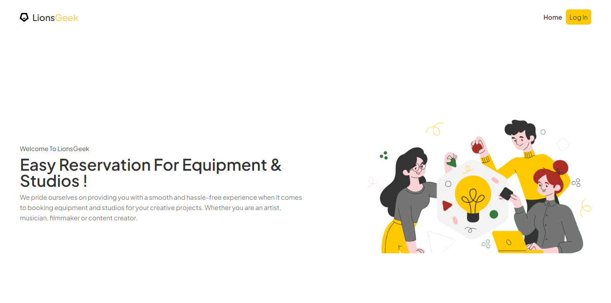
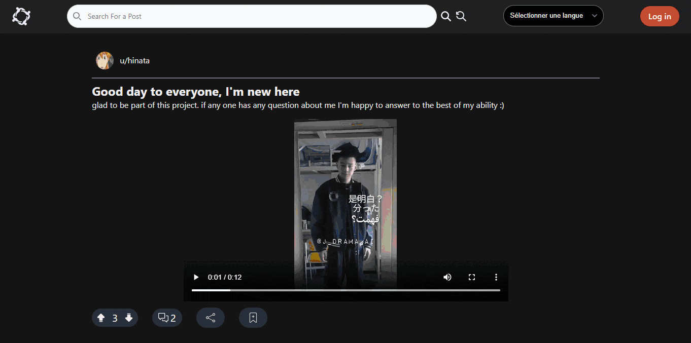

# Oussama Jebrane Portfolio

Thank you for taking the time to check my portfolio.
This portfolio was made with hard work and effort in the hope to make a basic introduction to my career.

# Table of Contents

1. ### [About Me](#aboutme)
2. ### [Websites I've coded](#projects)
3. ### [Contact Me](#contact")

# About Me 

## My Journey Through Web Development

Hello! I'm a self-taught web developer with a passion for solving puzzles and tackling challenging problems. This passion naturally led me to the world of programming and coding.

### The Beginning

My journey began with the **CS50 Introduction to Computer Science** course. It was during this course that I discovered my interest in web programming.

### The Dive into Frontend

From there, I immersed myself in the essentials:
- **HTML**
- **CSS**
- **SCSS**
- **Bootstrap**
- **JavaScript**
- **React**

### Exploring the Backend

After mastering frontend development, I ventured into the backend:
- **PHP**
- **Laravel**
- **Livewire**
- **Alpine.js**
- **Firbase**
- **Tailwind CSS**

### Finding My Passion

Throughout my journey, I found a special interest in **JavaScript** and **React**. These technologies have become my core strengths and my favorite tools to work with.

# Websites I've Coded 

## [Lionsgeek Management](https://mylionsgeek.ma/)
A website built for managing studio and equipment reservations for the [LionsGeek Association](https://lionsgeek.ma/).

---

## [Blog & Chat](https://myblogproject.vercel.app)
A Reddit-inspired blogging platform where users can post images and videos, and chat with each other.

---

## [YuGiOh! Cards Palette Generator](https://ygo-palette-client.vercel.app/)
A fun project that generates color palettes based on cards from the famous Yu-Gi-Oh! anime.

# Contact Me 

You can reach out to me through the following platforms:

  

  <a href="https://github.com/Osama-Jeb">
    GitHub
  </a>
  <a href="https://www.linkedin.com/in/oussama-jebrane">
    LinkedIn
  </a>
  <a href="mailto:jebrane.dev@gmail.com">
    Email
  </a>

